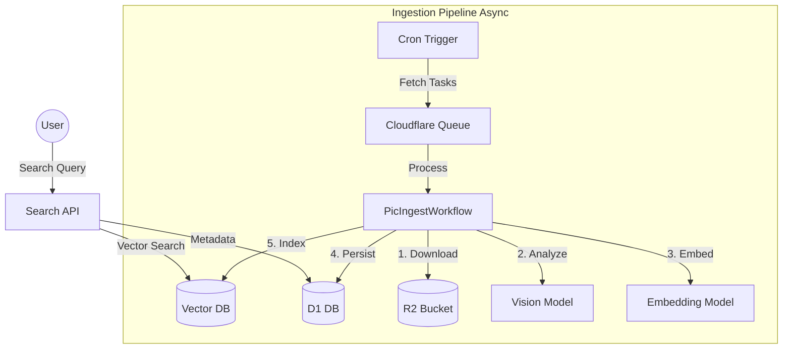

# Pic v6.0 - Semantic Image Gallery

[](https://workers.cloudflare.com/)
[](LICENSE)

**Pic** 是一个基于 Cloudflare Serverless 生态构建的现代化智能图库系统。
v6.0 版本彻底重构了架构，引入了 **Vectorize** 和 **Workflows**，实现了真正的 **AI 语义搜索** 和 **双流存储**。

## 🌟 核心特性 (Features)

*   **🔍 语义搜索 (Semantic Search)**：不再仅仅依靠标签匹配，你可以搜索“忧郁的雨天”、“赛博朋克城市”，AI 模型理解你的意图并返回精准结果。
*   **🏗️ 双管道架构 (Dual-Pipeline)**：
    *   **Ingestion Pipeline**: 慢速、异步处理大图下载、AI 分析和向量化。
    *   **Search Pipeline**: 极速响应用户查询，利用 Hono + D1 + Vectorize。
*   **💾 双流存储 (Dual-Mode Storage)**：
    *   **Raw**: 50MB+ 原始无损大图 (R2)。
    *   **Display**: 500KB 优化展示图 (R2)。
*   **🤖 全栈 AI (AI-Powered)**：
    *   **Vision**: 使用 LLaVA/Qwen 理解图片内容。
    *   **Embedding**: 使用 BGE-Base 生成向量索引。

## 📐 系统架构 (Architecture)



详细架构设计请参阅 [System Design Document](docs/architecture/DESIGN.md)。

## 🚀 快速开始 (Quick Start)

### 前置要求

1.  **Cloudflare 账号**: 开通 Workers (Standard), D1, R2, Vectorize, AI, Queues。
2.  **Unsplash API Key**: 用于图片源采集。
3.  **Wrangler CLI**: `npm install -g wrangler`。

### 安装步骤

```bash
# 克隆仓库
git clone https://github.com/your-username/pic.git
cd pic

# 安装依赖 (Monorepo)
npm install

# 初始化基础设施
npm run setup:infra

# 启动开发服务器
npm run dev
```

详细部署指南请参阅 [Setup Guide](docs/guide/SETUP.md)。

## 📚 文档索引

*   [**系统设计 (System Design)**](docs/architecture/DESIGN.md): 深入了解 v6.0 架构决策与数据流。
*   [**前端架构设计 (Frontend Design)**](docs/architecture/FRONTEND_DESIGN.md): 深入了解 Web 端技术选型与组件架构。
*   [**API 参考 (API Reference)**](docs/api/OPENAPI.md): 后端接口定义。
*   [**开发指南 (Development)**](docs/guide/DEVELOPMENT.md): 如何在 Monorepo 结构下开发与测试。
*   [**架构决策记录 (ADR)**](docs/ADR/001-architecture-decisions.md): 为什么我们选择 D1 而不是 KV？为什么选 Queue？

## 📝 许可证

MIT License
