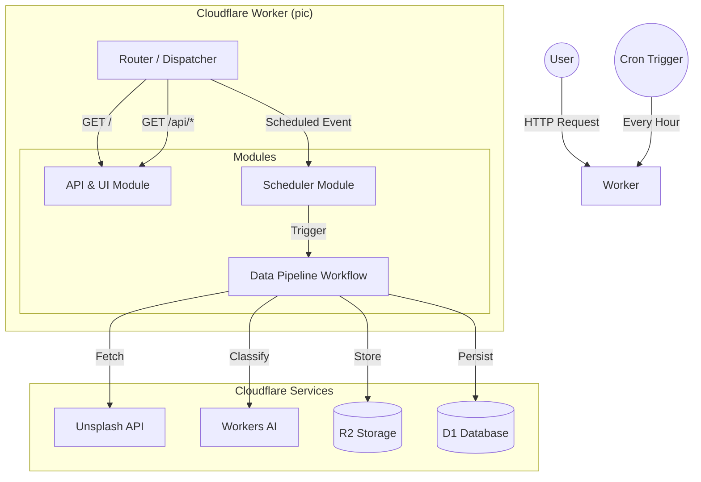

# 🖼️ Pic - AI Photo Gallery (Monolith Worker)

[](https://workers.cloudflare.com/)
[](LICENSE)

基于 Cloudflare 全家桶（Workers + D1 + R2 + AI + Workflows）构建的一体化智能相册系统。
它能够全自动地从 Unsplash 收集高质量图片，使用 AI 进行分类，并对外提供极速的图片展示服务。

本项目完全使用 **TypeScript** 编写，利用静态类型检查确保系统的健壮性和可维护性，特别是在处理复杂的 Workflow 状态和数据库查询时。

## ✨ 核心特性

- 🏗️ **单体架构 (Monolith)**：仅需部署一个 Worker，即可同时处理前端展示、API 服务、定时调度和后台工作流。
- 🛡️ **类型安全 (Type-Safe)**：全链路 TypeScript 开发，提供极致的开发体验和代码可靠性。
- 🤖 **全自动采集**：通过 Cron Trigger 每小时触发，自动从 Unsplash 获取最新图片。
- 🧠 **AI 智能分类**：集成 Cloudflare AI 模型，对每张图片进行内容识别和打标签。
- 📦 **Serverless 存储**：图片原图存入 R2，元数据存入 D1。
- 🔄 **稳健的工作流**：使用 Cloudflare Workflows 编排下载、分类、存储任务，支持步骤级重试。
- 📊 **自适应清理**：内置容量管理逻辑，自动清理旧图片以保持存储用量在免费额度内（默认保留 4,000 张）。
- 🚀 **极速体验**：前端直接由 Worker 渲染，图片通过 R2 代理或 CDN 分发。

## 📚 文档中心 (Documentation)

我们将文档整理为以下几个部分，方便查阅：

### 🚀 快速入门
- [**快速上手 (Getting Started)**](docs/guide/GETTING_STARTED.md): 从零开始部署你的第一个 Pic 实例。
- [**开发指南 (Development Guide)**](docs/guide/DEVELOPMENT.md): 本地开发环境搭建与调试技巧。

### 📖 参考手册
- [**系统架构 (Architecture)**](docs/reference/ARCHITECTURE.md): 深入了解单体 Worker 的内部设计与数据流。
- [**API 文档 (API Reference)**](docs/reference/API.md): 前后端 HTTP 接口定义。
- [**配置说明 (Configuration)**](docs/reference/CONFIGURATION.md): 环境变量与 `wrangler.toml` 配置详解。

### 🔧 故障排除
- [**常见问题 (FAQ)**](docs/troubleshooting/FAQ.md): 部署失败、API 报错等常见问题的排查与解决。

## 🚀 快速预览

### 1. 配置环境

```bash
# 克隆仓库
git clone https://github.com/your-username/pic.git
cd pic

# 安装依赖
npm install

# 配置 Unsplash API Key
wrangler secret put UNSPLASH_API_KEY
```

### 2. 创建资源

```bash
# 创建 D1 数据库
wrangler d1 create pic-d1

# *重要*：将返回的 database_id 填入 wrangler.toml 的 [d1_databases] 部分

# 初始化数据库结构
wrangler d1 execute pic-d1 --remote --file=workers/pic-scheduler/schema.sql

# 创建 R2 存储桶
wrangler r2 bucket create pic-r2
```

### 3. 一键部署

```bash
npm run deploy
```

详细步骤请参考 [快速上手指南](docs/guide/GETTING_STARTED.md)。

## 🏗️ 简要架构图



## 📝 许可证

MIT License
