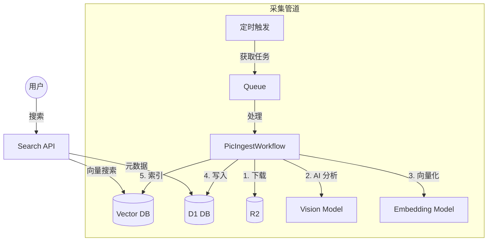

# Pic - 智能语义图库

[](https://workers.cloudflare.com/)
[](LICENSE)

基于 Cloudflare Serverless 生态构建的 AI 图库系统，支持自然语言语义搜索。

## 特性

- **语义搜索**：用自然语言搜图，如"忧郁的雨天"、"赛博朋克城市"
- **双管道架构**：异步采集（下载 → AI 视觉分析 → 向量化 → 索引）+ 极速搜索 API
- **双流存储**：原始大图 + 优化展示图，均存储在 R2
- **全栈 AI**：LLaVA 理解图片内容，BGE 生成向量索引

## 架构



## 快速开始

```bash
git clone https://github.com/7893/pic.git
cd pic
npm install
npm run dev
```

完整部署指南见 [Setup Guide](docs/guide/SETUP.md)。

## 文档

- [系统设计](docs/architecture/DESIGN.md)
- [前端架构](docs/architecture/FRONTEND_DESIGN.md)
- [API 参考](docs/api/OPENAPI.md)
- [开发指南](docs/guide/DEVELOPMENT.md)
- [架构决策记录](docs/ADR/001-architecture-decisions.md)

## 许可证

MIT
