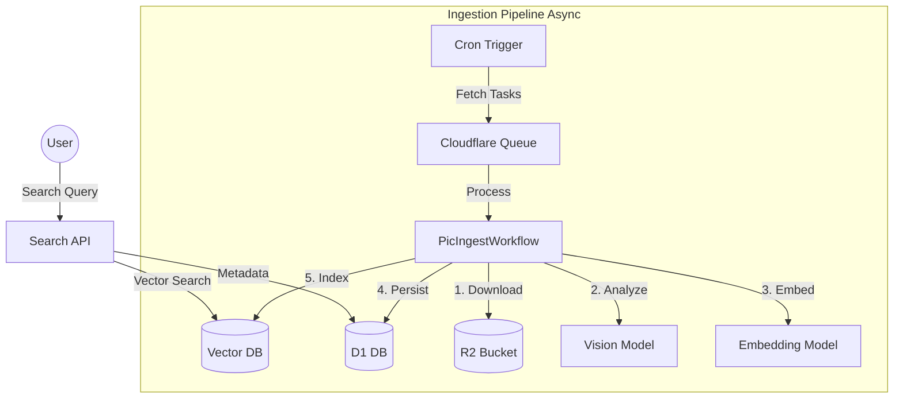

# Pic - Semantic Image Gallery

[](https://workers.cloudflare.com/)
[](LICENSE)

**Pic** is an AI-powered photo gallery built on Cloudflare's serverless ecosystem, featuring semantic search via Vectorize and automated ingestion via Workflows.

## Features

- **Semantic Search**: search with natural language like "sad rainy day" or "cyberpunk city"
- **Dual Pipeline**: async ingestion (download → AI vision → embedding → index) + fast search API
- **Dual Storage**: raw originals + optimized display images on R2
- **Full AI**: LLaVA for image understanding, BGE for vector embeddings

## Architecture



## Quick Start

```bash
git clone https://github.com/7893/pic.git
cd pic
npm install
npm run dev
```

See [Setup Guide](docs/guide/SETUP.md) for full deployment instructions.

## Docs

- [System Design](docs/architecture/DESIGN.md)
- [Frontend Architecture](docs/architecture/FRONTEND_DESIGN.md)
- [API Reference](docs/api/OPENAPI.md)
- [Development Guide](docs/guide/DEVELOPMENT.md)
- [Architecture Decisions](docs/ADR/001-architecture-decisions.md)

## License

MIT
