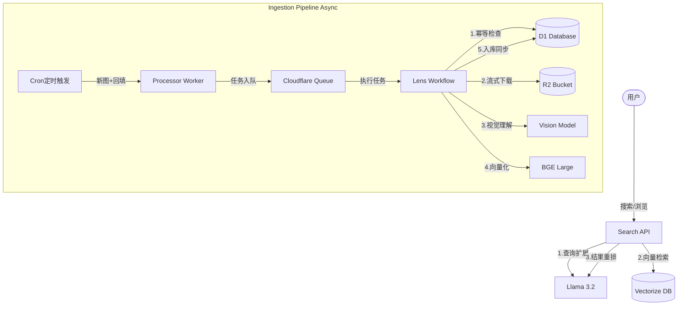

# Lens 核心架构与算法详解 (01-ARCHITECTURE)

Lens 是一个基于 Cloudflare 边缘计算栈构建的高性能 AI 图片搜索引擎。本项目的核心目标是**将非结构化的视觉世界（Unsplash）通过 AI 转化为语义化的、可供自然语言搜索的数字资产**。

为了实现这一目标，Lens 采用了**双管道解耦架构**。

---

## 1. 宏观架构：双管道设计

Lens 的后端被逻辑划分为两个完全独立的管道，通过 **Cloudflare Queues** 和 **Workflows** 进行削峰填谷和异步解耦。

### 1.1 搜索管道 (Search Pipeline) - 同步、低延迟

这是用户直接感知的接口层，其核心挑战在于**语义对齐**。

1.  **查询扩展 (Query Expansion)**: 当用户输入关键词（如 "孤独"）时，Llama 3.2 11B 模型会将其扩展为视觉语义词（如 "lonely, solitary person, misty street, dim lights"），并自动完成跨语言翻译。
2.  **向量初筛 (Vector Retrieval)**: 使用 BGE Large 模型将扩展后的文本转化为 1024 维向量，在 **Vectorize** 中进行余弦相似度检索，秒级返回 Top 100 候选。
3.  **大模型重排 (LLM Re-ranking)**: 将 Top 50 候选图片的 AI 描述和元数据再次提交给 Llama 3.2，根据与原始查询词的相关性进行精细化排序，剔除向量检索中常见的“语义偏离”。
4.  **结果合并**: 从 **D1** 读取最终元数据，通过 **R2** 代理返回图片流。

### 1.2 采集管道 (Ingestion Pipeline) - 异步、持久化

这是系统的“心脏”，负责图库的持续扩张。

1.  **调度器 (Cron)**: 每小时整点触发 `lens-processor`。
2.  **双向贪婪算法**: 详见下文算法部分。
3.  **任务分发 (Queue)**: 图片任务进入队列，平滑 CPU 瞬时压力。
4.  **状态机任务 (Workflow)**:
    - **检查存在**: 毫秒级 D1 查询，确保不重复处理。
    - **流式存图**: 原始图与展示图并行上传至 R2。
    - **视觉理解**: AI Vision 模型生成图片 Caption 和多维度 Tags。
    - **原子写入**: 将分析结果与向量一次性写入 D1 和 Vectorize。

---

## 2. 核心算法：高水位线采集模型 (High Water Mark Ingestion)

Unsplash API 免费版限制每小时 **50 次** 请求。为了在极低配额下实现最大吞吐量，Lens 采用了自研的采集算法。

### 2.1 向前追赶 (Forward Catch-up)

- **目标**: 获取自上次运行以来新发布的图片。
- **逻辑**:
  1. 从 `page=1` 开始抓取。
  2. 如果当前页的图片 ID 列表里没有数据库中的 `last_seen_id`（高水位线），则全部入库并继续下一页。
  3. 如果在当前页发现了 `last_seen_id`，则只截取该 ID 之前的图片，并立即停止。
  4. **更新锚点**: 只要第 1 页的第一张图 ID 不同，立即更新 `last_seen_id`。

### 2.2 向后回填 (Backward Backfill)

- **目标**: 挖掘历史库存。
- **逻辑**:
  1. 读取 `backfill_next_page`。
  2. 在满足 API 剩余配额的前提下（Remaining > 1），持续向后翻页。
  3. **偏移修正**: 算法会自动根据本周期内发现的新图数量（`totalNewFound`），按每页 30 张的比例，自动跳过相应的历史页码，避免重复扫描相同内容。
  4. **状态保存**: 处理完成后更新下一周期的起始页。

---

## 3. 容错与重试机制

- **Workflow 状态化**: 每个图片的处理被拆分为 5 个独立的 Step。如果 AI 服务临时中断，Workflow 会在 30 秒后自动重试，最多尝试 10 次，且不会重新下载已经存入 R2 的图片。
- **兜底同步 (`runVectorSync`)**: 定时任务会扫描 D1 中 `ai_embedding` 非空但创建时间晚于 `vectorize_last_sync` 的记录，进行向量索引的二次确认，防止由于网络抖动导致的索引丢失。

---

## 4. 资源消耗模型 (Cost Analysis)

- **Workers AI**: 核心成本项。1.8 万张图片的初始回填需要约 **1.8 亿 Neurons**。
- **R2 出口**: 0 费用。图片代理接口保证了流量成本仅限于 Cloudflare Workers 的调用费。
- **D1/Vectorize**: 存储占用极低，10 万级数据量下月度存储费几乎为 0。

---

## 5. 架构图示

