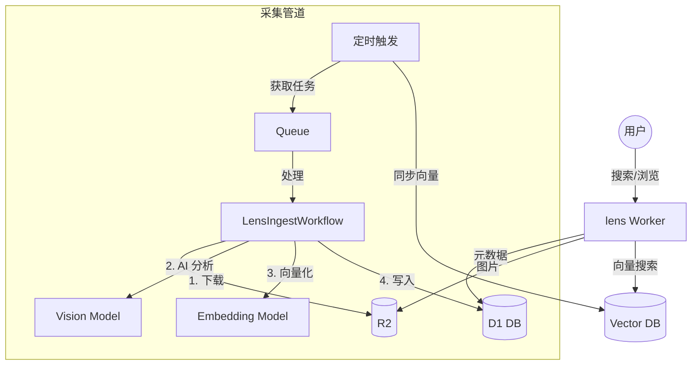

# Lens System Design

## Architecture

Two pipelines: **Ingestion** (write) and **Search** (read).



### Ingestion Pipeline

```
Cron (hourly) → Processor scheduled handler
  → fetch 30 random Unsplash photos
  → send to Queue (process-photo messages)
  → Queue consumer creates LensIngestWorkflow per photo
  → Workflow steps:
      1. download-and-store: raw + display images → R2
      2. analyze-vision: Llama 3.2 Vision generates caption
      3. generate-embedding: BGE Large generates 1024-dim vector
      4. persist-d1: metadata + embedding → D1
  → Cron also syncs all D1 embeddings → Vectorize (idempotent upsert)
```

### Search Pipeline

```
User query → lens Worker (Hono)
  → Llama 3.2 expands short queries (query expansion)
  → BGE Large embedding of expanded query text
  → Vectorize.query(vector, topK)
  → D1 lookup by matched IDs
  → return results with scores + full metadata
```

Frontend is bundled as static assets in the same Worker.

## Components

| Component | Tech | Name |
|-----------|------|------|
| Main Worker | Hono (API + static frontend) | `lens` |
| Processor Worker | Queue/Workflow | `lens-processor` |
| Database | D1 (SQLite) | `lens-db` |
| Object Storage | R2 | `lens-r2` |
| Vector Index | Vectorize (1024d, cosine) | `lens-vectors-v2` |
| Task Queue | Queues | `lens-queue` |
| Vision AI | `@cf/meta/llama-3.2-11b-vision-instruct` | — |
| Embedding AI | `@cf/baai/bge-large-en-v1.5` | — |

## D1 Schema

```sql
CREATE TABLE images (
    id TEXT PRIMARY KEY,
    width INTEGER,
    height INTEGER,
    color TEXT,
    raw_key TEXT,
    display_key TEXT,
    meta_json TEXT,
    ai_tags TEXT,
    ai_caption TEXT,
    ai_embedding TEXT,
    created_at INTEGER
);
```

## R2 Layout

```
raw/{id}.jpg       # original quality
display/{id}.jpg   # optimized for web
```
