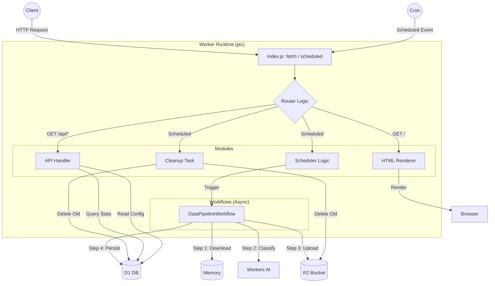

# 🏗️ 系统架构设计深度解析 (Single Worker Monolith)

本文档详细解析了 **Pic** 项目的单体架构设计。尽管从表面看只有一个 Cloudflare Worker，但其内部采用了模块化分层设计，通过不同的 Trigger 实现了多角色的并发处理。

## 1. 架构核心原则

1.  **Single Responsibility at Module Level** (模块级单一职责)：即使都在同一个 Worker 进程内，API 处理、定时调度、后台流水线也是逻辑隔离的模块。
2.  **Event-Driven** (事件驱动)：系统行为由外部事件（HTTP 请求、Cron 触发、Workflow Step）驱动，而非传统的长轮询。
3.  **State Management** (状态管理)：利用 D1 (SQL) 和 R2 (Object Storage) 实现无状态计算节点的持久化。

## 2. 模块交互图 (Monolith Internal)



## 3. 详细模块说明

### 3.1 入口层 (Dispatcher)
- **文件**: `src/index.js`
- **职责**:
    - 监听 `fetch` 事件：路由 HTTP 请求到对应的 API 或 HTML 渲染函数。
    - 监听 `scheduled` 事件：路由 Cron 触发到调度器逻辑。
    - 异常捕获与统一响应格式。

### 3.2 调度器 (Scheduler)
- **职责**:
    - **Fetch**: 每小时调用 Unsplash API 获取新图片列表。
    - **Deduplication**: 查询 D1 数据库，过滤掉已存在的图片 ID。
    - **Enqueue**: 将新图片作为任务参数，触发 `DataPipelineWorkflow`。
    - **Self-Healing**: 检查上次运行状态，如果异常则尝试重试（可选）。

### 3.3 数据流水线 (DataPipelineWorkflow)
- **职责**:
    - 这是一个由 `Cloudflare Workflows` 驱动的持久化工作流。
    - **Step 1 (Download)**: 从 Unsplash URL 下载图片 buffer。
    - **Step 2 (Classify)**: 将 buffer 传给 Cloudflare AI (ResNet/ViT)，获取图片分类标签 (e.g., "landscape", "portrait")。
    - **Step 3 (Store)**: 将图片 buffer 上传至 R2，路径为 `category/id.jpg`。
    - **Step 4 (Persist)**: 将图片元数据（ID, URL, Category, AI Confidence, Size, Color）写入 D1 `Photos` 表。
- **特性**:
    - **Steps Retries**: 每个步骤独立重试，失败不影响整体进度。
    - **State**: 工作流状态自动持久化，支持暂停和恢复。

### 3.4 清理模块 (Cleanup)
- **职责**:
    - **Capacity Management**: 每次 Cron 执行后检查 `Photos` 表总数。
    - **Policy**: 如果超过配置上限（默认 4,000 张），按 `downloaded_at` 升序删除最旧的图片。
    - **Consistency**: 必须同时删除 D1 记录和 R2 文件，确保数据一致性。
    - **Logging**: 记录清理操作到 `CleanupLog` 表。

### 3.5 前端展示 (Frontend)
- **职责**:
    - **SSR**: 服务端渲染简单的 HTML 页面（注入初始状态）。
    - **API**: 提供 `/api/photos` 分页查询接口。
    - **Proxy**: 提供 `/image/:key` 代理接口，隐藏 R2 真实地址（未来可迁移至 Custom Domain）。

## 4. 数据与存储设计

### 4.1 D1 Schema (SQLite)

```sql
CREATE TABLE Photos (
    unsplash_id TEXT PRIMARY KEY,
    r2_key TEXT NOT NULL,
    ai_category TEXT,
    ai_confidence REAL,
    width INTEGER,
    height INTEGER,
    color TEXT,
    likes INTEGER,
    photographer_name TEXT,
    downloaded_at DATETIME DEFAULT CURRENT_TIMESTAMP
);

CREATE TABLE GlobalStats (
    id INTEGER PRIMARY KEY DEFAULT 1,
    total_photos INTEGER,
    total_workflows INTEGER,
    last_updated DATETIME
);

CREATE TABLE CleanupLog (
    id INTEGER PRIMARY KEY AUTOINCREMENT,
    photos_deleted INTEGER,
    r2_files_deleted INTEGER,
    cleanup_reason TEXT,
    executed_at DATETIME
);
```

### 4.2 R2 Key Strategy

```
{category}/{unsplash_id}.jpg
```
- **Reason**: 按分类分文件夹存储，方便后续按目录浏览或导出。
- **Example**: `landscape/abc12345.jpg`, `portrait/xyz67890.jpg`

## 5. 扩展性讨论

虽然目前是单体架构，但设计上已预留了拆分接口：
- **Frontend Split**: 如果 UI 流量过大，可将 `fetch` 处理逻辑剥离到独立的 Worker，只共享 D1/R2 读取权限。
- **Queue Integration**: 如果 Unsplash 抓取量剧增，可在 Scheduler 和 Pipeline 之间引入 `Cloudflare Queues` 进行削峰填谷。
